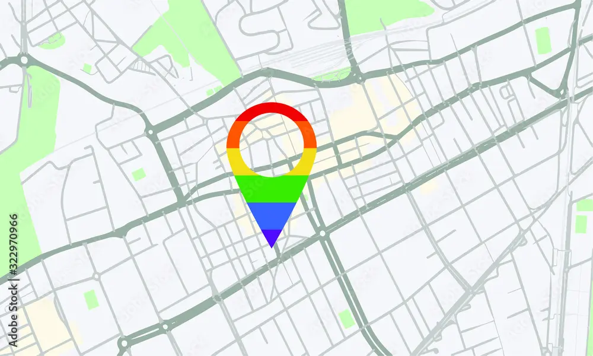

---
{"title":"Arkhold","draft":false,"tags":null,"publish":true,"name":null,"path":"2. Atlas/1. Settlements/Arkhold.md","permalink":"/2-atlas/1-settlements/arkhold/","PassFrontmatter":true}
---

# Arkhold

A mighty, yet small and secluded fortress city in the northern expanse.

Arkhold used to be the capital of *Suth Ka'al*, the northernmost [Monkhalyri](../../3.%20The%20Races/2.%20The%20Monkhalyr/2.%20Mechanics.md) city-state. Less than a century ago the [Urashalyri](../../3.%20The%20Races/6.%20The%20Urashalyr/2.%20Mechanics.md) Empire crossed the mountain pass and swallowed these lands.

Despite nominally belonging to the Empire now, the northern expanse is too far removed from the empire's center and too insignificant to warrant a sufficient military presence.

Arkhold still stands firm, seeing itself as the rightful ruler of these lands.

The current walls and buildings of Arkhold where build on the ancient ruins of *Zhar-Kaith*, the ancient Jewel of the north, a Monkhalyri City of old, swallowed by time millenia ago.

# `=this.name`

---
> [!infobox]
> 
> 
> ## **`=this.name`**
> 
>
> 
> ## - Facts -
> | Type | Name |
> | ---- | ---- |
> | **Aliases** | `=this.aliases` |
> | **Category** | `=this.rank` |
> | **** | `=this.aspects` |
> | **Aspect of** | `=this.aspect_of` |
> | **Portfolio** | `=this.portfolio` |
> | **Followers** | `=this.followers` |
> | **Organisations** | `=this.organisations` |
> | **Symbols** | `=this.symbol` |
> | **Godly Relations** |  |

> [!quote|author] The Quoted, yyyy
> This is the first quote

 

> [!quote|author] The Quoted, at a place, at X day
> This is the second quote

 