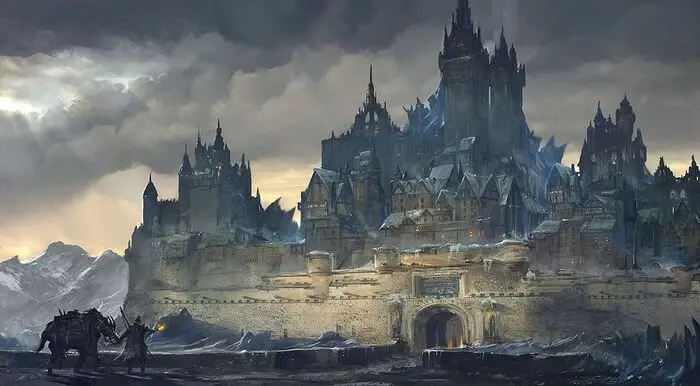

---
{"title":"Arkhold","draft":false,"tags":null,"publish":true,"name":"Arkhold","aliases":"The Black Bastion","category":"Fortress City,  City-State,  Former Capital","usage":"Trade-Hub, Fortress, Defence, Territorial Capital","population":10000,"condition":"Declining","nation":null,"relations":null,"religions":null,"organisations":null,"leader":null,"governance":"Clerical Oligarchy (Official),  Totalitarian Triumvirate (Inofficial)","leaders":"Lord Commander (Informal),  The Circle of the Nine (Formal)","places":null,"economy":"Regulated","defence":"City Walls,  The Black Guard,  City Watch,  Standing Military,  Protection Runes","magic":"Heavily Regulated","PassFrontmatter":true}
---

# Arkhold

---
> [!infobox]
> 
> 
> ## **Arkhold**
> 
>
> 
> ## - Overview -
> |  |  |
> | ---- | ---- |
> | **Aliases** | The Black Bastion |
> | **Category** | Fortress City,  City-State,  Former Capital |
> | **Function** | Trade-Hub, Fortress, Defence, Territorial Capital |
> | **Location** | [The Northern Expanse](../2.%20Nations%20&%20Areas/The%20Northern%20Expanse.md) |
> | **Nation** | [Urashalyri Empire](../../4.%20The%20Races/6.%20The%20Urashalyr/2.%20Mechanics.md) (Nominally),  Self Governed |
> | **Population** | 10000 |
> | **Inhabitants** | [Monkhalyr](../../4.%20The%20Races/2.%20The%20Monkhalyr/1.%20Lore.md),  [Markhalyr](../../4.%20The%20Races/3.%20The%20Markhalyr/1.%20Lore.md), [Urashalyr](../../4.%20The%20Races/6.%20The%20Urashalyr/1.%20Lore.md) |
> | **Condition** | Declining |
> | **Governance** | Clerical Oligarchy (Official),  Totalitarian Triumvirate (Inofficial) |
> | **Leaders** | Lord Commander (Informal),  The Circle of the Nine (Formal) |
> | **Seat of Power** | The Black Spire |
> | **Relations** | The Skybound Holds (Ally),  Clan Drazhmir (Neutral),  The Urashalyri Empire (Tensions) |
> | **Organizations** | [The Burning Hammer](../../6.%20Organizations/The%20Burning%20Hammer.md),  [[The Circle of the Nine\|The Circle of the Nine]] |
> | **People of Note** | [Lord Marek Hraldorn](../../5.%20Dramatis%20Personae/Lord%20Marek%20Hraldorn.md) |
> | **Places of Note** | The Black Spire,  Temple of the Nine,  The Ruins of Zhar-Kaith,  Clifftop Ward,  Coldstone Ward,  Ironwind Ward,  The Wailing Labyrinth |
> | **Economy** | Regulated |
> | **Defence** | City Walls,  The Black Guard,  City Watch,  Standing Military,  Protection Runes |
> | **Magic** | Heavily Regulated |
> | **Primary Religions** | [The Nine](../../3.%20Gods%20&%20Religion/4.%20The%20Nine/A_The%20Nine.md),  [The Burning Judge](../../3.%20Gods%20&%20Religion/4.%20The%20Nine/G_The%20Burning%20Judge.md), [The Silent King](../../3.%20Gods%20&%20Religion/4.%20The%20Nine/C_The%20Silent%20King.md) |

> [!quote|author clean] *"When they came, they came with shining steel and promises of peace. They left with Arkhold's coin and sons. But the north is ours yet. What the Empire forgets, Arkhold remembers."*
> Elara of the Council of Nine, Reflections on the Northern Wars

> [!quote|author clean] *"The north is cold and cruel, and it’s easy to lose faith. But in Arkhold, with the Nine as our witness, we are as much stone as the walls we defend."*
> City Watchman Mirdan, in conversation at the North Gate

 

## Basic Information:

A mighty, yet small and secluded fortress city in the northern expanse.

Arkhold used to be the capital of *Suth Ka'al*, the northernmost [Mokhalyr](../../4.%20The%20Races/2.%20The%20Monkhalyr/1.%20Lore.md) city-state and leader of the *Skybound Holds*, a federation of the most significant city-states in the north.

The current walls and buildings of Arkhold where build on the ancient ruins of *Zhar-Kaith*, the ancient Jewel of the north, a monkhalyri city of old, swallowed by time millenia ago.

Less than a century ago the [Urashalyr](../../4.%20The%20Races/6.%20The%20Urashalyr/1.%20Lore) Empire crossed the *Narrow Sea* and swallowed these lands.
Despite nominally belonging to the Empire now, the northern expanse is too far removed from the empire's center and too insignificant to warrant a sufficient military presence.

In essence, *Arhold* was mostly allowed to keep its identity and remain self governed. Yet the annual *Imperial Tithe* is a heavy strain on the Economy and imperial representatives are watching developments closely.

Despite all this: Arkhold still stands firm, seeing itself as the rightful ruler of these lands.

 

## Governance:

Arkhold has been traditionally governed by the *Circle of the Nine*, a ruling Council consisting of the High Priests of [The Nine](../../3.%20Gods%20&%20Religion/4.%20The%20Nine/A_The%20Nine.md). Its power was absolute and its decicions where steared by god-fearing and the advise of leading members of Arkhold's society.

Having been both an independent city-state and leader of the most powerful federation in the north, the social elite of Arkhold holds no love for the urashalyri invaders.

Currently Arkhold officially is part of and ows tithe to the Empire after suffering a catastrophic defeat by the hands of the *Empress's Fists*. 

In reality, the *Imperial Core* lays thousands of kilometers away, across the *Narrow Sea* and in the grand scheme of things, the north is far too insignificant, which resulted in the Unprecedented:

Despite refusing to bend the knee during negotiations, Arkhold was allowed to remain mostly self-governing.
The *Circle of Nine* remained the defacto leaders, with a permanent urashalyri representation present. 

This precarious balance is in danger, as the *Lord Commander* of the *Black Guard* and military leader of Arkhold [Lord Marek Hraldorn](../../5.%20Dramatis%20Personae/Lord%20Marek%20Hraldorn.md), is amassing support, reviving old alliances and some say is already in control of the city.

Arkhold, having long been the strongest political and military force, has long standing relations in the noth. Some of the *Skyward Holds* remain independent to this day and Arkhold still holds significant influence on their political decisions.

[The Markhalyr](../../4.%20The%20Races/3.%20The%20Markhalyr/1.%20Lore.md) of *Suth Ka'al*, although heavily declining and a shadow of their former power, once where honored allies and are responsible for the impressive defenses of the city.

 

## Defences:

Arhold's walls stand strong and tall, almost 15 Meters high and carved from the black rock of the *Ashen Peaks*. The walls are additionally fortified with markhalyri protection runes and have yet to be breached in many centuries.

- Does it have fortifications? Which ones and where?

### Watch & Guard:

- What is the name of its law enforcement, and its defensive forces?
- Standing army or militia?
- How strict or relaxed is law enforcement?

### Magic:
- Is Magic banned, regulated or encouraged?
- Details

 

## Social:

Arhold has a population of roughly 10‚000. The majority are [race], with a significant number of [race] and [race], and enclaves of [race].

- Social Welfare: Indifferent or benevolent (Comes in shades)
- What is the overall social hierarchy and how do they interact?
- What is the general standard of living?

### Public Institutions:

- Who are the main social institutions and organizations and how do they interact?

 

## Culture:

- What are some of its unique cultural traditions or customs?
- What is the general attitude towards cultural diversity?

### Cultural Institutions:

- What are organizations or landmarks with cultural significance? 

### Celebrations:

- What are some of its festivals or holidays?

 

## Economy:

- Is the Economy regulated or free? (Comes in shades) A few details will do
- What are its primary industries?
- What are the primary exports and imports?
- Does it have trade connections?
- Is there a black market?

### Major Businesses:

- What are some of its notable financial institutions or businesses?

 

## Geography: 

Geography, Climate, Urban Structure

- What are its climate and surrounding terrain, and natural resources?
- How is it located in relation to other important locations, and routes?

### Urban Structure:

- How big is the city, and how is it divided?
- What are notable features or landmarks?

 

## Law & Crime:

[City] has a [level] level of criminal activity. Most being [type of crime], or [type of crime].

- What is the overall crime rate?
- Does it have organized crime or any major criminal organizations operating in it?
- What are the dangerous areas, if any?

### Rule of Law

- How does its justice system work?
- What are some notable laws or policies?
- How are crimes handled and by whom?
- Reform or Punishment?

 

## Religion

- What is the attitude towards religion and religious diversity?

### Religions & Faiths

- What is the dominant religion?
- What are secondary, and minor religions?

### Temples & Shrines

- What are its religious buildings, organizations, or landmarks?

---

## Local History

 

### 
 - Founding (Date) - 

Why, when, and how was its foundation?

### 
 - Event (Date) - 

Description / Key Points about the event

---

## Myths & Deeds:

>[!Warning| clean no-i] *"Title1"*
> Write one or more well-known storys such as a myth or deed.
---
>[!Warning| clean no-i] *"Title2"*
> Write one or more well-known storys such as a myth or deed.
---