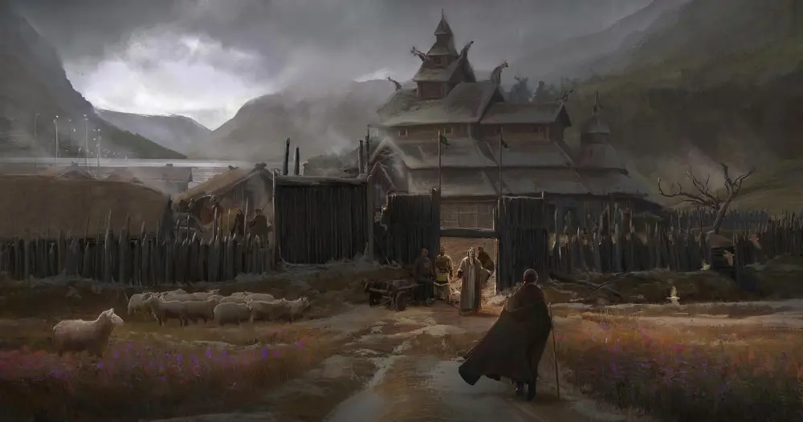

---
{"title":"Respite","draft":false,"tags":null,"publish":true,"name":"Respite","aliases":"","category":"Village","usage":"Agricultural Hub, Shelter","location":"The Northern Expanse, Near Arkhold, Northern Urashalyr Satrapy","nation":"Urashalyr Empire (Officially)","population":"ca 250","inhabitants":"Mostly Mokhalyr, Farmers, Peasants, Tradespeople","condition":"Declining","governance":"Federal Empire","leaders":"Empress","seat_of_power":"Town Hall","relations":"Arkhold (Ally), Urashalyr Empire (Tensions), The Skybound Holds (Ally)","organizations":"Farmers Coalition","people":"Mayor Jareth Milkho, Lieutenant Mika Oresh","places":"City Hall, Temple of the Weeping Mother, Shrine of the Stranger, Shrine of the Gilded Magnate, The Northern Pride Inn","commerce":"Regulated","defence":"Pallisade, Watchtowers, Town Watch","religions":"The Weeping One, The Gilded Magnate, The Burning Judge","PassFrontmatter":true}
---

# Respite

---
> [!infobox]
> 
> 
> ## **Respite**
> 
>
> 
> ## - Overview -
> |  |  |
> | ---- | ---- |
> | **Aliases** | `=this.aliases` |
> | **Category** | Village |
> | **Function** | Agricultural Hub, Shelter |
> | **Location** | The Northern Expanse, Near Arkhold, Northern Urashalyr Satrapy |
> | **Nation** | Urashalyr Empire (Officially) |
> | **Population** | ca 250 |
> | **Inhabitants** | Mostly Mokhalyr, Farmers, Peasants, Tradespeople |
> | **Condition** | Declining |
> | **Governance** | Federal Empire |
> | **Leaders** | [Empress Thala’vren Kaeshara Tanvir](../../5.%20Dramatis%20Personae/Empress%20Thala’vren%20Kaeshara%20Tanvir.md) (Official), Mayor Jareth Milkho (Locally), The Circle of the Nine (Regional) |
> | **Seat of Power** | Town Hall |
> | **Relations** | Arkhold (Ally), Urashalyr Empire (Tensions), The Skybound Holds (Ally) |
> | **Organizations** | Farmers Coalition |
> | **People of Note** | Mayor Jareth Milkho, Lieutenant Mika Oresh |
> | **Places of Note** | City Hall, Temple of the Weeping Mother, Shrine of the Stranger, Shrine of the Gilded Magnate, The Northern Pride Inn |
> | **Economy** | Regulated |
> | **Defence** | Pallisade, Watchtowers, Town Watch |
> | **Primary Religions** | The Weeping One, The Gilded Magnate, The Burning Judge |
> 

> [!quote|author clean] *"The trees creep closer by the year, and the shadows are watching."*
> Melisandre the Apothecary, over a mug of warm ale, in the Northern Pride Inn

> [!quote|author clean] *"Mother Helga has not aged a day, the gods are truly with her."*
> The Quoted, at place X, at time Y

 

## Basic Information:

A humble, yet vastly important Village in the outskirts of [Arkhold's](Arkhold.md) immediate realm of influence.

Respite is 

 

## Governance:

- What is the governmental system?
- Who are its leaders and notable political groups?
- What is its relationship with other settlements or nations?

 

## Defences:

- Does it have walls? Are they fortified?
- Does it have fortifications? Which ones and where?

### Watch & Guard:

- What is the name of its law enforcement, and its defensive forces?
- Standing army or militia?
- How strict or relaxed is law enforcement?

### Magic:
- Is Magic banned, regulated or encouraged?
- Details

 

## Social:

[City] has a population of XX‚XXX. The majority are [race], with a significant number of [race] and [race], and enclaves of [race].

- Social Welfare: Indifferent or benevolent (Comes in shades)
- What is the overall social hierarchy and how do they interact?
- What is the general standard of living?

### Public Institutions:

- Who are the main social institutions and organizations and how do they interact?

 

## Culture:

- What are some of its unique cultural traditions or customs?
- What is the general attitude towards cultural diversity?

### Cultural Institutions:

- What are organizations or landmarks with cultural significance? 

### Celebrations:

- What are some of its festivals or holidays?

 

## Economy:

- Is the Economy regulated or free? (Comes in shades) A few details will do
- What are its primary industries?
- What are the primary exports and imports?
- Does it have trade connections?
- Is there a black market?

### Major Businesses:

- What are some of its notable financial institutions or businesses?

 

## Geography: 

Geography, Climate, Urban Structure

- What are its climate and surrounding terrain, and natural resources?
- How is it located in relation to other important locations, and routes?

### Urban Structure:

- How big is the city, and how is it divided?
- What are notable features or landmarks?
- What are its Wards?

 

## Law & Crime:

[City] has a [level] level of criminal activity. Most being [type of crime], or [type of crime].

- What is the overall crime rate?
- Does it have organized crime or any major criminal organizations operating in it?
- What are the dangerous areas, if any?

### Rule of Law

- How does its justice system work?
- What are some notable laws or policies?
- How are crimes handled and by whom?
- Reform or Punishment?

 

## Religion

- What is the attitude towards religion and religious diversity?

### Religions & Faiths

- What is the dominant religion?
- What are secondary, and minor religions?

### Temples & Shrines

- What are its religious buildings, organizations, or landmarks?

---

## Local History

 

### 
 - Founding (Date) - 

Why, when, and how was its foundation?

### 
 - Event (Date) - 

Description / Key Points about the event

---

## Myths & Deeds:

>[!Warning| clean no-i] *"Title1"*
> Write one or more well-known storys such as a myth or deed.
---
>[!Warning| clean no-i] *"Title2"*
> Write one or more well-known storys such as a myth or deed.
---