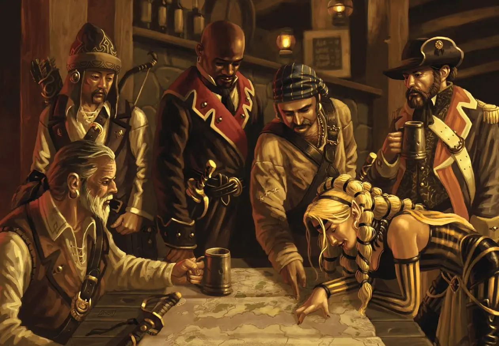

---
{"title":"2. Mechanics","draft":false,"tags":[null],"publish":true,"path":"2. The Races/2. The Monkhalyr/2. Mechanics.md","permalink":"/2-the-races/2-the-monkhalyr/2-mechanics/","PassFrontmatter":true}
---

> [!infobox]
> 
> 
> ## **The Monkhalyr**
> 
> 
> 
> ### Facts
> 
> | Type | Name |
> | --- | --- |
> | Type | Humanoid, Sentient |
> | Weaving Discipline | All |
> | Size | 1.8 Meters (SM 0)
> | Lifespan | 80 Years |
> | Society | Fractured: Kingdoms, City-states, Tribes, etc |
> | Governance | Varies: Kings, Chieftains, Dukes, etc |

# **The Monkhalyr**
**Whats left of greatness**
 

## Mandatory Racial Traits & Mutations [4 pts]

> [!warning|no-i c-orange]- Residue & Weaving [4]
> **[Increased Residue Buildup 1](../../4.%20Mechanics/Weaving%20Traits.md#Increased%20Residue%20Buildup) [-5]**
> - 1 Residue per Energy spend
> 
> **[Increased Weaving Diversity](../../4.%20Mechanics/Weaving%20Traits.md#Increased%20Weaving%20Diversity) [9]**
> - All Disciplines
>

 

## Recommended/Befitting Racial Traits:
- Language: Monkhalyri (Native)
- Language: Monkhalyri (Dialect) [1]
- TL: Any [varies]
- [Weaving Empowerment](1.%20Essence%20Weaving.md#Weaving%20Empowerment) ([Any](../../1.%20The%20Magic/3.%20The%20Disciplines%20&%20Aspects.md)) [4/2 per lvl]
- Weaving Talent ([Any](../../1.%20The%20Magic/3.%20The%20Disciplines%20&%20Aspects.md)) [10/lvl]
- [Untouched](../../4.%20Mechanics/Weaving%20Traits.md#Untouched) [5]
- [Veil-Marked](../../4.%20Mechanics/Weaving%20Traits.md#Veil-Marked) [-5]
- [Spell/Rune Crafter](../../4.%20Mechanics/Traits.md#Spell/Rune%20Crafter) [25]
- [Dabbler](../../4.%20Mechanics/Traits.md#Dabbler) [1]

 

## Taboo-Traits (Locked or Require Unusual Background):
- [Reduced Residue Buildup](../../4.%20Mechanics/Weaving%20Traits.md#Reduced%20Residue%20Buildup) (Requires [Untouched](../../4.%20Mechanics/Weaving%20Traits.md#Untouched))
- [Weaving Resistance](../../4.%20Mechanics/Weaving%20Traits.md#Weaving%20Resistance) (Requires [Untouched](../../4.%20Mechanics/Weaving%20Traits.md#Untouched))

 
  