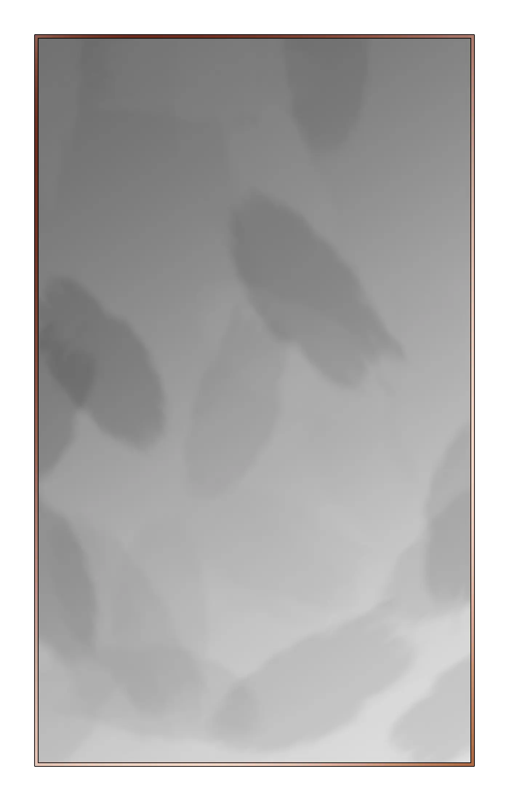

---
{"title":null,"draft":false,"tags":null,"publish":true,"name":"The Venthalyr","aliases":"","type":"Sentient, Humanoid","ancestry":"Ancient Monkhalyr","adult":"?","lifespan":"Indefinite in their forests","height":"1.7 meters","weight":"","weaving_discipline":"Shamanism - Breaking the Cycle","society":"Mostly united","governance":"Druidic circles","speech":"Venthalyri","path":"3. The Races/4. The Venthalyr/1. Lore.md","permalink":"/3-the-races/4-the-venthalyr/1-lore/","PassFrontmatter":true}
---

# **The Venthalyr**
**The forests expand and will consume all**

---
> [!infobox]
> 
> 
> ## **The Venthalyr**
> 
> 
> 
> ## - Facts -
> |  |  |
> | ---- | ---- |
> | **Aliases** | `=this.aliases` |
> | **Type** | Sentient, Humanoid |
> | **Ancestry** | Ancient Monkhalyr |
> | **Test** | ? Years (Adult)  Indefinite in their forests Years (Lifespan) |
> | **Height** | 1.7 meters |
> | **Weight** | `=this.weight` |
> | **Weaving Discipline** | Shamanism - Breaking the Cycle |
> | **Society** | Mostly united |
> | **Governance** | Druidic circles |
> | **Speech** | Venthalyri |

 

>[!quote| author clean] *"This is the first quote"*
>The Quoted, at a place, at X day

>[!quote| author clean] *"This is the second quote"*
>The Quoted, at a place, at X day

 

## Basic Information:
- Small Description
- Summary of important details

 

## Current Affairs:
- Politics, current situation, important details

 

## Racial Traits:

**Trait1:**
- Description

**Trait2:**
- Description

---

## Myths and History:

**Fact1:**
- Description

**Myth2:**
- Description

---