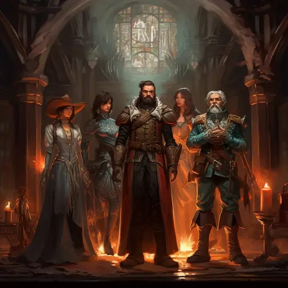

---
{"title":"Lore","draft":false,"tags":null,"publish":true,"name":"The Mokhalyr","aliases":"","type":"Sentient, Humanoid","ancestry":"Ancient Monkhalyr","adult":"18","lifespan":"80","height":"1.8 meters","weight":"70 kg","weaving_discipline":"All","society":"Fractured, Declining, City-States, Warring Kingdoms","governance":"Varies, Elder Councils, Mage Circles, Hereditary Monarchs, etc","speech":null,"PassFrontmatter":true}
---

# The Mokhalyr
**What's left of Greatness**

---
> [!infobox]
> 
> 
> ## **The Mokhalyr**
> 
> 
> 
> ## - Facts -
> |  |  |
> | ---- | ---- |
> | **Aliases** | `=this.aliases` |
> | **Type** | Sentient, Humanoid |
> | **Ancestry** | Ancient Monkhalyr |
> | **Age** | 18 Years (Adult)  80 Years (Lifespan) |
> | **Height** | 1.8 meters |
> | **Weight** | 70 kg |
> | **Weaving Discipline** | All |
> | **Society** | Fractured, Declining, City-States, Warring Kingdoms |
> | **Governance** | Varies, Elder Councils, Mage Circles, Hereditary Monarchs, etc |
> | **Speech** | `=this.speech` |

>[!quote| author clean] *"In the heart of ruin, we will find strength. In the heart of darkness, we will find fire. And if the world would see us fall again, let it burn alongside us."*
>High Elder Kalanis, staring at the Broken Throne, Year of the Withering

>[!quote| author clean] *"Once, we spoke to the stars, tore open the heavens and bent the tides with but a whisper. Now, we are but fading echoes, lost to the silence we brought upon us."*
>Council Elder Yllara, at the Last Pillar of Varn, on the First Day of Remembrance

 

## Basic Information:
The *Monkhalyr* are the last fragments of an ancient and mighty race, whose ancestors were once the pinnacle of sentient life, a race renowned for their mastery of both the arcane and mundane arts.
Their near seemingly limitless grasp of the arcane altered the world forever. Marvelous cities and vast empires, were wonders of engineering and magic, monuments to their unmatched understanding of the world and the forces beyond it.

The Mokhalyr's ambition and overreach, however, ultimately led to the collapse of their once-great civilizations. In their hybis, their relentless pursuit of arcane power and innovation, they pushed the boundaries of reality, stretching, piercing and rupturing *the Veil* that separates the material world from *the Mirror*. This culminated in a catastrophic event, known as *the Convergence*. It tore open the barrier between reality and the chaotic Mirror, unleashing devastation across the world. This cataclysmic tragedy occurred aeons ago, but its effects still linger and the *Veil* remains forever scarred and thin.

The catastrophe forever altered the world, shattering the Veil, leading to unimaginable devastation and leaving the Monkhalyr scattered and their legacy tainted by the chaos they unwittingly unleashed. Today, they survive as remnants of their former glory, fragmented into warring city-states, unstable alliances and fractured kingdoms, each culture fighting to preserve the remaining vestiges of their power.

Despite the risks, some Monkhalyr still seek to harness the *Mirror's* power, driven by the desperate hope of restoring their former glory or protecting what little remains of their world.

- Monkhalyr society is fragmented, with no unified structure. Each city-state, tribe or kingdom interprets the lessons of ancient history differently, and has widely varying cultural and political outlooks, leading to frequent conflicts.
- The Monkhalyr are the only one out of all the currently documented sentient species, that has the innate ability to command *all* of the [Weaving Disciplines](../../1.%20The%20Magic/3.%20The%20Disciplines%20&%20Aspects.md), but there are many aspects of the World yet to be studied.
- Physically, they differ greatly between places of origin. Though most appear slightly taller than [the Venthalyr](../4.%20The%20Venthalyr/1.%20Lore.md) and slightly shorter than the [Urashalyr](../6.%20The%20Urashalyr/1.%20Lore.md) and [Anthalyr](../5.%20The%20Anthalyr/1.%20Lore.md), with some individuals bearing faint luminescent patterns on their skin due to residual arcane energy.

 

## Current Affairs:
The Monkhalyr’s political landscape is marked by deep divisions. Their society, once united in mighty, world-spanning empires by the pursuit of knowledge, power and perfection in all aspects of life, is now fragmented into independent, often warring, states.

Each city-state, tribe or kingdom is led by local rulers, some driven by a desire to restore the old ways, while others are resigned to their inevitable decline and some have devolved into mere barbarian tribes. Political alliances are fragile and short-lived, often rupturing into conflict as Monkhalyr leaders vie for control over what little power they can grasp, resources, relics, and arcane sites.
This fractured nature has left them vulnerable to other powers in Vilenought and there is almost no political system or cultural identity that is not represented by at least one Monkhalyri society.

While they remain among the most skilled in magical disciplines, their power has become precarious due to the unstable energies of the Mirror they continue to draw from, risking corruption and backlash.

Some Monkhalyr struggle with the fact that their mastery over magic, once their greatest pride, now accelerates their decline. Yet, rather than abandoning their ancient practices, many cling to them with a fierce resolve, seeing them as both their birthright and burden. 
Others yet, have seemingly learned from past mistakes or are haunted by the ancient past and have banned all use of magic within their borders.

Each kingdom has its own interpretation of the events that led to the Convergence, often placing blame on rival factions, which perpetuates the cycles of animosity between them.

The Monkhalyr are a dying race, clinging to the remnants of their past while facing an uncertain future. The ruins of their ancient civilizations are haunted by the aftermath of the Convergence, where the Veil remains unstable, thin, and brittle. These places are rich in arcane potential and powerful ancient artifacts, but bear the risk of repeating past mistakes.

---

## Myths and History:

**Fact1:**
- Description

**Myth2:**
- Description

---