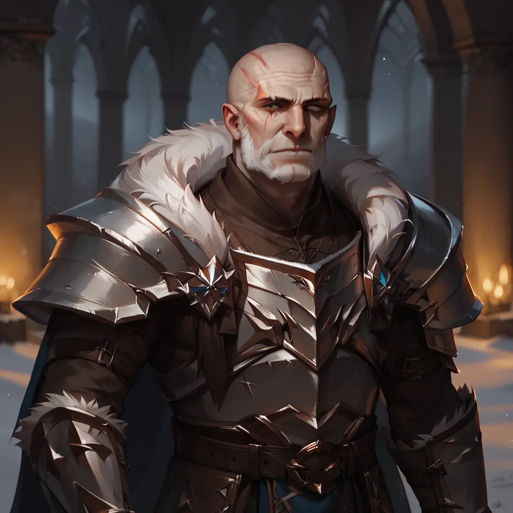

---
{"title":"Lord Marek Hraldorn","draft":false,"publish":true,"name":"Lord Marek Hraldorn","age":"Early 50s","occupation":"Leader, General, Governor","aliases":"The Unyielding","titles":"Lord Commander of Arkhold,  Warden of the Howling Rock","culture":null,"allegiances":"The Burning Hammer","features":"Scarred Face,  Blind left eye,  Muscular,  Tall,  Lean","affiliations":"The Skybound Holds (Ally),  Clan Drazhmir (Neutral),  The Urashalyri Empire (Tensions)","location":"Arkhold","PassFrontmatter":true}
---

# Lord Marek Hraldorn

---
> [!infobox]
> 
> 
> ## Lord Marek Hraldorn
> 
> 
> 
> ## **- Facts -**
> |  |  |
> | ---- | ---- |
> | **Race** | [Monkhalyr](../4.%20The%20Races/2.%20The%20Monkhalyr/1.%20Lore.md) |
> | **Culture** | `=this.culture` |
> | **Aliases** | The Unyielding |
> | **Rank/Title** | Lord Commander of Arkhold,  Warden of the Howling Rock |
> | **Allegiance** | [The Burning Hammer](../6.%20Organizations/The%20Burning%20Hammer.md) |
> | **Relations** | The Skybound Holds (Ally),  Clan Drazhmir (Neutral),  The Urashalyri Empire (Tensions) |
> | **Location** | [Arkhold](../2.%20Atlas/1.%20Settlements/Arkhold.md) |
> 
> ## **- Description -**
> |  |  |
> | ---- | ---- |
> | **Age** | Early 50s |
> | **Eyes** | Amber |
> | **Hair** | Bald |
> | **Distinctive Features** | Scarred Face,  Blind left eye,  Muscular,  Tall,  Lean |
> 
> ## **- Biography -**
> |  |  |
> | ---- | ---- |
> | **Born** | Unknown |
> | **Died** | - |
> | **Origin** | [Arkhold](../2.%20Atlas/1.%20Settlements/Arkhold.md) |
> | **Residence** | [Arkhold](../2.%20Atlas/1.%20Settlements/Arkhold.md) |
> | **Profession** | Leader, General, Governor |
> | **Primary Belief** | [The Nine](../3.%20Gods%20&%20Religion/4.%20The%20Nine/A_The%20Nine.md),  [The Burning Judge](../3.%20Gods%20&%20Religion/4.%20The%20Nine/G_The%20Burning%20Judge.md),  [The Gilded Magnate](../3.%20Gods%20&%20Religion/4.%20The%20Nine/I_The%20Gilded%20Magnate.md) |
> | **Relatives & Relationships** | - |

> [!quote|author clean] This is the first quote
> The Quoted, at place x, at time y

> [!quote|author clean] This is the second quote
> The Quoted, at place x, at time y

 

## Basic Information:

Lord Marek Hraldorn has been the Commander of [Arkhold's](../2.%20Atlas/1.%20Settlements/Arkhold.md) City Watch and Elite Military Force, *The Black Guard* for over two decades. He is a decorated Veteran of many border skirmishes but is yet to prove his worth in a real war scenario. 

Lord Hraldorn is known as a zealous follower of the [the Burning Judge](../3.%20Gods%20&%20Religion/4.%20The%20Nine/G_The%20Burning%20Judge.md) and a stern traditionalist, longing to bring *Arkhold* back to its former glory and, keeping in line with the *Judge's* teachings, bringing justice to those that humiliated his home.

Lately there are increasingly damning rumours about his growing ambition and influence, some even whispering of open rebellion and a reach for power.

 

## Description:

- Appearance, Distinctive Features
- Characteristcs and Behavior
- Special Abilities
- Quirks

 

## Background:
- Origin and important details
- Aspects about them that are of importance

 

## Relationships, Allies & Enemies
- Summary of any known and important professional & personal relationships.
- Description of affiliated organizations and groups

 

## Abilities, Resources & Weaknesses
- Do they possess any special powers of note?
- Do they command any significant resources?
- Are there any weaknesses of note?

---

> [!column]
> 
>> [!bug|no-i ttl-c clean]- **Encounters**
>>
>> **Situation 1**
>> - What happened
>>
>> **Situation2**
>> - What else?
>
>> [!bug|no-i ttl-c clean]- **Secrets & Rumors**
>> 
>> **Secret1**
>> - Details
>>   
>> **Rumor2**
>> - Details

---