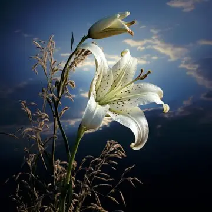

---
{"title":"1. Mourning Lilly","draft":false,"tags":null,"publish":true,"name":"Mourning Lilly","aliases":"Graveroot","category":"Flower,  Root","rarity":"Common","habitat":"Graveyards,  Battlefields","origin":"Unknown","traits":"Poison,  Medicine,  Decoration","path":"7. Herbarium/1. Mourning Lilly.md","permalink":"/7-herbarium/1-mourning-lilly/","PassFrontmatter":true}
---

# Mourning Lilly

---
> [!infobox]
> 
> 
> ## **Mourning Lilly**
> 
> 
> 
> ## - Facts -
> | Type | Name |
> | ---- | ---- |
> | **Aliases** | Graveroot |
> | **Category** | Flower,  Root |
> | **Rarity** | Common |
> | **Habitat** | Graveyards,  Battlefields |
> | **Origin** | Unknown |
> | **Traits** | Poison,  Medicine,  Decoration |

 

>[!quote| author clean] *"In the stillness of sorrow, the Mourning Lily thrives, a testament to life emerging from death's embrace."*
>Mother Alaya, at the Graveyard of Silent Waters, on the 25th day of the Harvest Moon.

 

## Basic Information:
The *Mourning Lily*, delicate and pale, draws life from death's embrace. Found among graveyards and battlefields, it drinks from blood-soaked soil and thrives on decay. Its blossoms, pale and somber, are cherished as memorials, adorning basins to honor the fallen. When brewed, its petals offer solace in the form of a calming tea, though its taste is pronounced—sharp and almost metallic, lingering as a reminder of sorrow. Almost always available in temples of [the Mother Of Sorrow](../4.%20Gods%20&%20Religion/4.%20The%20Nine/2.%20She%20Who%20Weeps.md), the tea is served to mourners as an offering of peace and to ease grieving hearts. The root, however, yields a far stronger, sleep-inducing draught potent enough to lull even the restless to sleep—or, when misused, to silence a life with its deadly embrace.

 

**Soothing Tea:**
- The petals of the *Mourning Lily* are brewed into a soothing tea with calming effects. While its strong, metallic taste is notable, it is revered for its ability to steady the nerves.
- This tea is often offered during rites of remembrance and is commonly used by [the Urashalyr](../3.%20The%20Races/6.%20The%20Urashalyr/2.%20Mechanics.md), who sip it as a grounding ritual during delicate negotiations, believing its somber qualities bring clarity and empathy to those in high-stakes discussions.

**Sleep-Inducing Draught:**
- When prepared from the *Mourning Lily's* root, the tea becomes a concentrated sedative, inducing deep sleep.
- Due to its overpowering flavor, it cannot easily be disguised in drinks, ensuring that any misuse is typically known before consumption.
- Its potency makes it useful in medical practices for severe insomnia or pain, but, at higher doses, it becomes dangerously toxic, sometimes used in poisons, to cause respiratory arrest.

---

> [!column]
>> [!error| no-i ttl-c] Harvestables:
>> 
>>**Petals**
>>- Decoration, especially in Memorial Basins.
>>- Soothing tea with calming properties and a sharp, metallic taste, often used during rites of remembrance and in negotiations by the Urashalyr.
>>
>>**Roots**
>>- Potent sleep-inducing tea, used for severe insomnia or pain management.
>>- Overdoses result in respiratory failure, making it a common component in poisons, though the taste is strong enough to be difficult to mask.
>
>> [!error| no-i ttl-c] Lore & Myths:
>> 
>>**Marker of Bloodshed**
>>- The _Mourning Lily_ is believed to grow wherever intense suffering or death has occurred, springing forth as a silent testament to the blood spilled on the soil. Some believe that if a large patch of _Mourning Lilies_ suddenly appears, it foretells impending conflict or a hidden graveyard nearby.
>>
>>**The Gift for the Fallen**
>>- Legend holds that the _Mourning Lily_ was a gift from _She Who Weeps_, whose tears fell upon the ground where her followers perished in battle. It is said her sorrow infused the flowers with the power to ease the pain of those who survive but mourn those who are lost. Almost always available in temples dedicated to the goddess, the tea made from its petals is offered to mourners as a way to soothe the spirit, helping both the living and the dead find peace

---