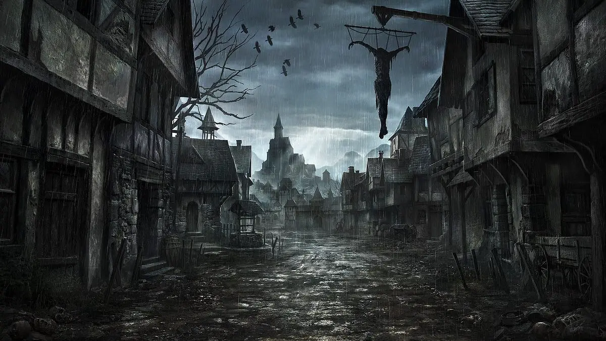

---
{"title":"The World of Vilenought","draft":false,"tags":null,"publish":true,"path":"index.md","permalink":"/index/","PassFrontmatter":true}
---

# The World of Vilenought

> [!quote] Beyond our world, not far, but close enough to touch it, yet forever distant and cut off by the Veil, lies the Mirror. A feint imprint of the reality we are so sure we call our own. Every stone cast in a still forest lake sends ripples down the surface of its misty, bleak projection in the Mirror. Or are we the projections? Are we mere echoes of the spirits that roam the dim forests beyond our reach? Beyond the Mirror still, to where only the bravest dare to pierce the Veil, lie the Shards. The fragmentation rising with every step, reality shifting, space streching and time in constant flux. Beyond the shard lies nothing. Nothing of such an agonizing depth, of such hopelessness and despair... Filled with silence, filled with the silence of dead gods, filled with the laughter of those who are not. But the Veil protects us.... For aeons it protected us... But the Veil is wearing thin.
> 

<iframe src="https://master-noiza.github.io/world-map/" width="100%" height="800px"></iframe>

---

## Table of Contents:

---

> [!column| no-t no-i]
>> [!bug| no-i ttl-c]- The Magic
>> - [[1. The Magic/1. Essence Weaving\|Essence Weaving]]
>> - [[1. The Magic/2. The Disciplines & Aspects\|The Disciplines & Aspects]]
>> - [[1. The Magic/3. The Spells\|The Spells]]
>> - [[1. The Magic/4. Creating new Spells\|Creating new Spells]]
>> - [[1. The Magic/5. Spell modification - On the Fly\|Spell modification - On the Fly]]
>> - [[1. The Magic/6. Spell modification - Stable\|Spell modification - Stable]]
>
>> [!error| no-i ttl-c]- The Races
>> - [[2. The Races/1. Overview\|Overview]]
>> - [[2. The Races/2. The Monkhalyr\|The Monkhalyr]]
>> - [[2. The Races/3. The Markhalyr\|The Markhalyr]]
>> - [[2. The Races/4. The Venthalyr\|The Venthalyr]]
>> - [[2. The Races/5. The Anthalyr\|The Anthalyr]]
>> - [[2. The Races/6. The Urashalyr\|The Urashalyr]]
>> - [[2. The Races/7. The Varashalyr\|The Varashalyr]]
>> - [[2. The Races/8. Additional Races\|Additional Races]]

> [!column| no-t no-i]
>> [!bug| no-i ttl-c]- The Gods
>> - [[3. Gods & Religion/The  Gods\|The  Gods]]
>
>> [!bug| txt-c ttl-c no-i]- The Mechanics
>> - [[4. Mechanics/Long-Term Fatigue\|Long-Term Fatigue]]
>> - [[4. Mechanics/Traits\|Traits]]
>> - [[4. Mechanics/General Rules & Specifics\|General Rules & Specifics]]
>> - [[4. Mechanics/Tables\|Tables]]

---

## Introduction to the setting:

**The World of Vilenought:**
 
In a time long forgotten, the world was ruled by the ambition and mastery of the *Monkhalyr*, the first and most dominant of the sentient races. Their relentless thirst for power led to their undoing. Through the reckless use of magic, they tore apart the Veil, the fragile barrier separating reality from the Mirror, a dark, twisted reflection of the world. This event, known as the *Convergence*, unleashed chaotic forces that forever altered the course of history.

Now, countless aeons later, the world is but a shattered remnant of its former glory. The great human empires have crumbled, and the Monkhalyr are fractured into war-torn kingdoms, desperately clinging to the ruins of their past. Their great cities lie in decay, haunted by the echoes of the Convergence, places where the *Veil* remains thin, and magic warps the fabric of reality.

Amid the remnants of this broken world, other races have risen, each scarred by the same cataclysm but twisted into new forms. The *Venthalyr*, once human, are now the embodiment of nature's darker side. These Wood Elves have been irrevocably changed by the untamed, magical forests that blend the real and the surreal. Immortal within their forest homes, they cannot survive long beyond them, and to sustain their race, they enslave humans, using them to birth new Venthalyr.

To the frozen north, the *Anthalyr*, a splinter faction of the Venthalyr, have forsaken their ancestors' brutal expansionism. Living a nomadic life, these Tundra Elves roam the icy steppes, surviving through blood rituals and a spiritual communion with the Mirror that guides them, even as it shortens their lives.

Deep within the mountains, the *Markhalyr*, the once-human Dwarves, battle their own slow extinction. Transformed by primordial magic, their flesh has melded with stone and metal, and with each new generation, more of their humanity is lost. They are master craftsmen, carving the essence of magic into their creations, yet they know their race is doomed, consumed by the very magic that made them.

The *Urashalyr*, an advanced and disciplined race descended from humans, have defied the brutish stereotype of Orcs. From the most unforgiving environments—volcanic plains and barren deserts—they have risen to forge an empire built on military prowess, diplomacy, and innovation. Though feared for their precision and ruthlessness in war, the Urakhalyr are also philosophers, poets, and scholars, dedicated to a rigid caste system that honors both the warrior and the thinker.

Diverging from their Urashalyri ancestors, the *Varashalyr* adapted to subterranean life after the Convergence. Towering at 3 meters tall with bioluminescent fungal growths, they are symbiotically connected to a semi-sentient fungus that grants them healing powers at the cost of their individuality. They wield potent reality magic but must be careful, as overuse threatens to unravel the very fabric of time and space.

The world is a grim, perilous place, filled with the scars of the Convergence and the ever-looming threat of the *Mirror*. Magic is unpredictable and dangerous, often twisting those who wield it, and the gods themselves, though distant, are a constant reminder of the world's peril. Worshiped out of fear more than reverence, these deities are embodiments of chaos, destruction, and sorrow, with only rare glimmers of hope.

The Veil grows ever thinner. The Mirror's influence spreads. The world teeters on the edge of oblivion, and those who remain struggle to survive, ever haunted by the echoes of their past mistakes and the looming darkness of their future.

---